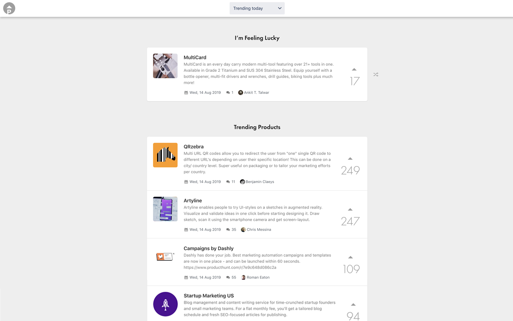

## What is Product Hunt Trending Tab Extension

Product Hunt Trending Tab replaces browser new tab screen with Product Hunt trending products, so that hunter, maker or followers get to know trending products everyday. It loads trending products periodically in background so you do not need to wait for loading every time you open a new tab.

## Install

Trusted by hunters, makers and followers! Install Product from [Chrome Web Store](https://chrome.google.com/webstore/detail/kfdccmmkggolbggggimdgbfgfgalgkjo) or [Mozilla Add-ons Store](https://addons.mozilla.org/firefox/addon/product-hunt-trending-tab/).

## View Online

[View Online](https://producthunt-trending-extension.now.sh/) version of extension.

## Backers

Thank you to all our backers! 🙏

## Feedback

Just write me an [email](mailto:omrglen@gmail.com), or create an [issue](issues).

## Give us a rating

If you enjoy using it, please help to write a review at [Chrome Web Store](https://chrome.google.com/webstore/detail/kfdccmmkggolbggggimdgbfgfgalgkjo) or [Mozilla Add-ons Store](https://addons.mozilla.org/firefox/addon/product-hunt-trending-tab/), and star this repo. This will motivate me a lot :)

## Related

- Product Hunt Trending Tab on [Product Hunt](https://github.com/omergulen/producthunt-trending-extension). (_will be updated_)
- [hacker-tab-extension](https://github.com/huchenme/hacker-tab-extension)
- [How to use React.js to create a cross-browser extension in 5 minutes](https://levelup.gitconnected.com/how-to-use-react-js-to-create-chrome-extension-in-5-minutes-2ddb11899815?source=friends_link&sk=055e5c73e0dd11fd8cb25130242f388e).
- [producthunt-trending](https://github.com/xiaomingplus/producthunt-trending)

## Disclaimer

Product Hunt Trending Tab is not affiliated with, sponsored by, or endorsed by Product Hunt Inc.
